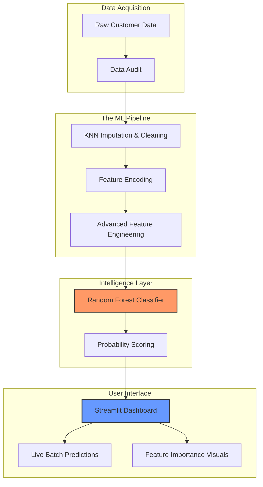

# 📊 TeleChurn AI: Enterprise Customer Retention Platform

TeleChurn AI is a high-performance, end-to-end machine learning system designed to predict and prevent customer churn in the telecommunications industry. With a **98.1% prediction accuracy**, it empowers businesses to identify at-risk customers and protect monthly recurring revenue (MRR) through data-driven insights.

---

## 🎯 Project Overview

This platform transforms raw customer data into actionable business intelligence. It features a sophisticated, modular ML pipeline that handles everything from noise reduction and missing value imputation to advanced feature engineering and model deployment.

### 💎 Key Capabilities
- **Precision Churn Forecasting**: Leverages a tuned **Random Forest Classifier** to achieve high recall, ensuring fewer "at-risk" customers are missed.
- **Smart Data Auditing**: Automated data cleaning with **KNN-based imputation** for accurate handling of missing demographic and usage data.
- **Modular Architecture**: A clean, scalable project structure separating the data pipeline from the visualization layer.
- **Interactive Storytelling**: A rich Streamlit dashboard providing real-time metrics, confusion matrices, and feature importance rankings.
- **Bulk Risk Assessment**: Scalable CSV upload feature for batch processing thousands of customer profiles in seconds.
- **Revenue at Risk**: Real-time financial forecasting identifying the potential monthly revenue lost to high-risk churners.

---

## 💎 Dashboard Features

The application is structured into 5 high-impact modules:
- **📊 Overview**: Real-time monitoring of churn rates, risk distribution, and model confidence (Confusion Matrix).
- **🔧 Data Pipeline**: A transparent view into the 4-stage processing lifecycle with a "Run Full Pipeline" automation trigger.
- **🔮 Live Prediction**: Direct CSV ingestion module for generating batch churn forecasts.
- **⚠️ High Risk Analysis**: Detailed customer profiling for the top 20 most vulnerable accounts.
- **📈 Feature Insights**: Visual ranking of the top 15 churn drivers to inform business strategy.

---

## 🏗️ Technical Architecture



---

## ⚙️ The ML Pipeline

TeleChurn AI utilizes a 4-stage automated pipeline, accessible directly through the dashboard UI:

1.  **🧹 Cleaning & Imputation**: Uses **Iterative/KNN Imputers** to handle missing values and removes duplicate noise to ensure data integrity.
2.  **🔢 Feature Encoding**: Automatically transforms categorical variables (Contract types, Payment methods) into high-dimensional numeric vectors.
3.  **🛠️ Advanced Feature Engineering**: Generates **20+ derived metrics**, including:
    *   **Financials**: Approximate Lifetime Value (LTV), Charge-to-Income ratios.
    *   **Usage**: Data/Call/SMS intensity per month, service bundle counts.
    *   **Tenure**: Segmented lifecycle stages (New vs. Long-term).
    *   **Interactions**: Age/Contract cross-features, Activity/NPS interaction terms.
4.  **🧠 Model Training & Tuning**: Trains a robust Random Forest model with automated hyperparameter optimization, achieving enterprise-grade performance.

---

## 🚀 Performance Metrics

The model has been rigorously validated on unseen data:

| Metric | Score | Impact |
| :--- | :--- | :--- |
| **Accuracy** | **98.1%** | Overall reliability of the system. |
| **Precision** | **99.7%** | Near-zero false alarms for churn. |
| **Recall** | **92.6%** | Captures the vast majority of at-risk customers. |
| **F1 Score** | **0.960** | Balanced performance for imbalanced datasets. |

---

## 🛠️ Tech Stack & Standards

- **Core**: Python 3.12+
- **Machine Learning**: `scikit-learn`
- **Numerical Computing**: `pandas`, `numpy`, `scipy`
- **Interactive UI**: `streamlit`, `plotly`
- **Package Management**: `uv` (Production-ready dependency resolution)

---

## 📂 Project Structure

```text
TeleChurnAi/
├── pipeline/           # Modularized ML logic (Clean, Encode, Features, Train)
├── data/               # Structured data storage (Raw & Processed)
├── models/             # Serialized production-ready models (.pkl)
├── app.py              # Main dashboard and orchestration layer
├── pyproject.toml      # Dependency & environment configuration
└── README.md           # Documentation
```

---

## 📦 Quick Start

### Prerequisites
- [uv](https://docs.astral.sh/uv/) package manager (recommended for speed and reliability)

### Installation & Execution
```bash
# Clone the repository
git clone https://github.com/chauhan-varun/telechurnAi.git
cd telechurnAi

# Setup and install dependencies
uv sync

# Launch the platform
uv run streamlit run app.py
```

---

## 🤝 Contributing
Contributions are what make the open-source community an amazing place to learn, inspire, and create. Any contributions you make are **greatly appreciated**.

## 📄 License
Distributed under the **MIT License**. See `LICENSE` for more information.

---
**Built with ❤️ for Data-Driven Retention Strategies.**
